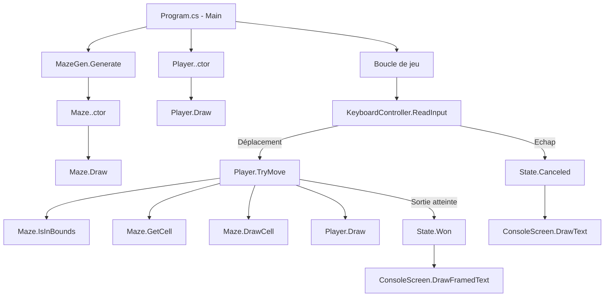

# Epsi.MazeCs

Jeu de labyrinthe ASCII en C# (console) : vous déplacez `@` dans un labyrinthe généré procéduralement pour atteindre la sortie `★`.

## Prérequis

- SDK .NET `9.0` (le projet cible `net9.0`)
- Un terminal compatible Unicode (Windows Terminal recommandé pour un meilleur rendu)

Vérifier la version installée :

```bash
dotnet --version
```

## Lancer le projet

Depuis la racine du repo :

```bash
dotnet run --project Program.csproj
```

Alternative (si vous êtes déjà dans le dossier du `.csproj`) :

```bash
dotnet run
```

## Contrôles

- `Z` ou `↑` : monter
- `S` ou `↓` : descendre
- `Q` ou `←` : gauche
- `D` ou `→` : droite
- `Échap` : quitter

## Schéma global du fonctionnement



## Détail des fonctions

### Program.cs

- Point d’entrée : initialise les composants (`KeyboardController`, `ConsoleScreen`, `Maze`, `Player`).
- Ajuste dynamiquement la taille du labyrinthe selon `Console.BufferWidth` / `Console.BufferHeight`.
- Dessine l’interface initiale (titre, labyrinthe, joueur, aide).
- Exécute la boucle principale : lit les entrées, applique le déplacement, change l’état (`Playing`, `Won`, `Canceled`).
- Affiche le message final puis attend une touche.

### MazeGen.cs

- `Generate()` :
	- Crée une grille remplie de murs (`Wall`).
	- Lance un DFS récursif (`GenerateRec`) en partant de `(0,0)` pour creuser des couloirs.
	- Mélange l’ordre des directions via un tableau de permutations (`Orders`) pour varier les labyrinthes.
	- Place explicitement la case de départ (`Start`) et la case de sortie (`Exit`).
	- Retourne la grille finale `CellType[,]`.
- `GenerateRec(position)` (fonction locale) :
	- Marque la case courante en couloir.
	- Tente des sauts de 2 cases dans chaque direction.
	- Si la cible est valide et encore murée, ouvre la case intermédiaire puis recurse.

### Maze.cs

- `Maze(MazeGen gen)` : génère la grille, calcule `Width`/`Height`, détecte la position de départ.
- `GetCell(Vec2d position)` : retourne le type de case (`Wall`, `Corridor`, `Start`, `Exit`).
- `IsInBounds(Vec2d position)` : vérifie qu’une position est dans les limites.
- `Draw(ConsoleScreen screen, Vec2d offset)` : dessine tout le labyrinthe case par case.
- `DrawCell(ConsoleScreen screen, Vec2d offset, Vec2d position)` : dessine une case unique avec son symbole et sa couleur.
- `FindStart()` : parcourt la grille pour trouver la case `Start`.

### Player.cs

- `Player(Vec2d startPosition)` : initialise le joueur sur la case de départ.
- `TryMove(Vec2d delta, Maze maze, ConsoleScreen screen, Vec2d offset)` :
	- Calcule la prochaine position.
	- Refuse le déplacement si hors bornes ou mur.
	- Met à jour l’affichage (redessine l’ancienne case puis le joueur).
	- Retourne `true` si la sortie est atteinte.
- `Draw(ConsoleScreen screen, Vec2d offset)` : dessine le joueur (`@`).

### KeyboardController.cs

- `Instructions` : texte d’aide affiché en bas de l’écran.
- `ReadInput()` : lit une touche et renvoie :
	- un vecteur de déplacement (`Vec2d`) si touche directionnelle,
	- un drapeau d’annulation si `Escape`,
	- ou aucune action pour les autres touches.

### ConsoleScreen.cs

- `DrawText(Vec2d position, string text, ConsoleColor? color = null)` :
	- Sécurise les coordonnées,
	- Positionne le curseur,
	- Applique la couleur,
	- Écrit le texte,
	- Gère les erreurs transitoires de redimensionnement console.
- `DrawFramedText(Vec2d position, string text, ConsoleColor? color = null)` :
	- Découpe le texte en lignes,
	- Calcule la largeur max,
	- Dessine une boîte Unicode autour,
	- Retourne la hauteur dessinée.

### Vec2d.cs

- `Zero` : vecteur `(0,0)`.
- `Add(Vec2d other)` : addition vectorielle.
- `Multiply(int factor)` : multiplication scalaire.
- `Midpoint(Vec2d other)` : point milieu entre deux positions.
- `IsInBounds(int width, int height)` : test de limites.

### Enums

- `State` : état de la partie (`Playing`, `Won`, `Canceled`).
- `CellType` : type de cellule du labyrinthe (`Corridor`, `Wall`, `Start`, `Exit`).
